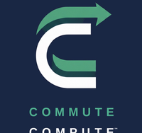

<p align="center">
  
</p>

<p align="center">
  
</p>

# CCDashDesignV15 - Commute Compute™ Dashboard Specification

**Status:** LOCKED — V15.0 (2026-02-07)
**Version:** 15.0
**Modified Date:** 2026-02-07
**Effective Date:** 2026-02-07
**Display:** 800×480px e-ink (TRMNL device)
**Refresh:** 60-second partial refresh cycle
**Renderer:** ccdash-renderer.js v1.80
**CommuteCompute:** v2.3 (Metro Tunnel Compliant)

---

> **LOCKED** — V15.0 specification locked (2026-02-07).
> Includes Departure Confidence, Lifestyle Context, Commute Analytics, and complete documentation compliance.
>
> **V13 Changes from V12:**
> - **Walking legs:** Half height of transit legs, single line of text
> - **Transit legs:** Double height for better focus and visibility
> - **Coffee stop:** Double size when configured
> - **Font sizes:** Increased slightly for e-ink readability
> - **Footer bar:** Increased height (32px → 40px), centered CC logo (inverted, no text)
> - **Live departures:** Transit "Next: X, Y min" times are LIVE UPDATED every refresh cycle
>
> **V12 Changes (inherited):**
> - Metro Tunnel compliance (effective 2026-02-01)
> - Next 2 departures display on all transit legs
> - Delay badge and bordered leg styling
> - Metro Tunnel station routing support
>
> **V14 Changes from V13.6:**
> - **Departure Confidence Score:** Real-time journey success probability (0-100%) displayed in status bar
> - **Lifestyle Context Engine:** Weather-aware suggestions (umbrella, jacket, sunglasses, hydration) in weather zone
> - **Commute Analytics:** KV-stored departure patterns for adaptive timing
> - **Enhanced Status Bar:** Confidence percentage alongside arrival time
> - **Enhanced Weather Zone:** Lifestyle suggestions below weather condition

---

## 1. Display Layout Overview

> **V13:** Walking legs are compact (single line), Transit/Coffee legs are double height

```
┌──────────────────────────────────────────────────────────────────────────────┐
│ HEADER (0-94px)                                                              │
│ ┌────────────┐ ┌──────────┐ ┌───────────────────────┐ ┌───────────────────┐  │
│ │ Location   │ │ Thursday │ │ ☕ GET A COFFEE       │ │ 24°               │  │
│ │            │ │ 11 Jan   │ │   + ARRIVE BY         │ │ Partly Cloudy     │  │
│ │  7:24      │ │ [STATUS] │ │   8:19am              │ │ [NO UMBRELLA]     │  │
│ │       AM   │ │ [DATA]   │ │                       │ │                   │  │
│ └────────────┘ └──────────┘ └───────────────────────┘ └───────────────────┘  │
├──────────────────────────────────────────────────────────────────────────────┤
│ STATUS BAR (96-124px) - Black background                                     │
│ LEAVE NOW → Arrive 8:19am                    [+8 min DELAY]        55 min    │
├──────────────────────────────────────────────────────────────────────────────┤
│ JOURNEY LEGS (132-432px) - Variable height legs                              │
│ ┌──────────────────────────────────────────────────────────────────────────┐ │
│ │ ① 🚶 Walk to Cafe                                                │ 4 MIN│ │
│ └──────────────────────────────────────────────────────────────────────────┘ │
│                                    ▼                                         │
│ ┌──────────────────────────────────────────────────────────────────────────┐ │
│ │ ② ☕ Coffee at Example Cafe                                              │ │
│ │                                                                          │ │
│ │      ✓ TIME FOR COFFEE • Quiet                        LEAVE   │ 16     │ │
│ │      ~3 min wait • Open                               7:40am  │ MIN    │ │
│ └──────────────────────────────────────────────────────────────────────────┘ │
│                                    ▼                                         │
│ ┌──────────────────────────────────────────────────────────────────────────┐ │
│ │ ③ 🚃 Route 96 Tram                                                       │ │
│ │                                                                          │ │
│ │      East Brunswick → City                           DEPART   │ 21     │ │
│ │      Next: 3, 8 min (LIVE)                           7:40am   │ MIN    │ │
│ └──────────────────────────────────────────────────────────────────────────┘ │
│                                    ▼                                         │
│ ┌──────────────────────────────────────────────────────────────────────────┐ │
│ │ ④ 🚶 Walk to Work                                                │ 8 MIN│ │
│ └──────────────────────────────────────────────────────────────────────────┘ │
├──────────────────────────────────────────────────────────────────────────────┤
│ FOOTER (440-480px) - Black background, 40px height                           │
│ WORK — 80 COLLINS ST            [CC LOGO]              ARRIVE  8:19am       │
└──────────────────────────────────────────────────────────────────────────────┘
```

**Leg Height Summary:**
| Type | Height | Lines |
|------|--------|-------|
| Walk | ~32px | 1 line (title only) |
| Transit | ~64px | 3 lines (title, route, next departures) |
| Coffee | ~64px | 3 lines (title, status, detail) |

---

## 2. Header Section (0-94px)

### 2.1 Current Location
- **Position:** `left: 12px, top: 4px`
- **Font:** 10px bold, UPPERCASE
- **Content:** Current address (e.g., "88 SMITH ST, COLLINGWOOD")
- **Source:** User configuration

### 2.2 Current Time (Clock)
- **Position:** `left: 8px, top: calculated` (bottom-aligned near status bar)
- **Font:** 82px bold
- **Format:** 12-hour (e.g., "7:24")
- **Positioning:** Bottom of clock digits touch the status bar area

### 2.3 AM/PM Indicator
- **Position:** Right of clock, bottom-aligned with coffee/weather boxes (y ≈ 68)
- **Font:** 22px bold
- **Content:** "AM" or "PM"

### 2.4 Day of Week
- **Position:** `left: clockWidth + 58px, top: 6px`
- **Font:** 20px bold
- **Content:** Full day name (e.g., "Thursday")

### 2.5 Date
- **Position:** `left: clockWidth + 58px, top: 28px`
- **Font:** 14px
- **Format:** "DD Month" (e.g., "11 January")

### 2.6 Service Status Indicator
- **Position:** Below day/date, `top: 46px`
- **Size:** 115×16px

| Status | Background | Border | Text |
|--------|------------|--------|------|
| Services OK | White | 1px black | "✓ SERVICES OK" |
| Disruptions | Black fill | None | "⚠ DISRUPTIONS" (white text) |

### 2.7 Data Source Indicator
- **Position:** Below service status, `top: 64px`
- **Size:** 115×16px (same as service status)

| Source | Background | Border | Text |
|--------|------------|--------|------|
| Live Data | Black fill | None | "● LIVE DATA" (white text) |
| Timetable Fallback | White | 1px black | "○ TIMETABLE FALLBACK" |

### 2.8 Coffee Decision Box (Conditional)
- **Position:** Between status indicators and weather box
- **Size:** Dynamic width (fills gap), height: 86px
- **Condition:** Only shown if journey includes coffee leg

#### 2.8.1 Coffee Available (canGet: true)
- **Background:** Black fill
- **Icon:** White coffee cup (drawn, not emoji)
- **Text:** 
  - "GET A COFFEE" (18px bold, white)
  - "+ ARRIVE BY" (12px, white)
  - Arrival time (28px bold, white)

#### 2.8.2 Coffee Skipped (canGet: false)
- **Background:** White with 2px black border
- **Icon:** Sad face (drawn circle with frown)
- **Text:** "NO TIME FOR COFFEE" (16px bold, black)

### 2.9 Weather Box
- **Position:** `right: 8px, top: 4px`
- **Size:** 172×86px
- **Border:** 2px solid black

#### 2.9.1 Temperature
- **Position:** Centered horizontally, `top: 26px` (middle-aligned)
- **Font:** 36px bold
- **Format:** "XX°" (e.g., "24°")

#### 2.9.2 Condition
- **Position:** Centered horizontally, `top: 50px`
- **Font:** 11px
- **Content:** Weather description (e.g., "Partly Cloudy")

#### 2.9.3 Umbrella Indicator
- **Position:** Bottom of weather box, 4px inset
- **Size:** 164×14px

| Condition | Background | Text |
|-----------|------------|------|
| Rain expected | Black fill | "BRING UMBRELLA" (white) |
| No rain | White + 1px border | "NO UMBRELLA" (black) |

---

## 3. Status Bar (96-124px)

- **Background:** Solid black (#000), no outline
- **Height:** 28px
- **Text:** White (#FFF)

### 3.1 Left: Status Message
- **Position:** `left: 16px`
- **Font:** 13px bold
- **Formats:**
  - `LEAVE NOW → Arrive 8:19am ✓` (on time)
  - `LEAVE IN X MIN → Arrive 8:19am` (buffer time)
  - `⏱ DELAY → Arrive 8:27am (+8 min)` (delays)
  - `⚠ DISRUPTION → Arrive 8:27am (+8 min)` (major issues)

### 3.2 Center-Right: Delay Box (Conditional)
- **Position:** Before total time
- **Size:** 80×18px
- **Condition:** Only shown if legs have actual delays (delayMinutes > 0)
- **Background:** White
- **Text:** "+X min DELAY" (11px bold, black, centered)

### 3.3 Right: Total Journey Time
- **Position:** `right: 16px`
- **Font:** 13px bold
- **Format:** "XX min" (e.g., "55 min")

---

## 4. Journey Legs Section (132-432px)

> **V13 MAJOR CHANGE:** Leg heights now vary by type for improved focus and readability.

### 4.1 Dynamic Layout with Variable Heights

| Leg Type | Height | Description |
|----------|--------|-------------|
| **Walk** | 1× (base) | Half height, single line of text |
| **Transit** (train/tram/bus) | 2× | Double height for focus and visibility |
| **Coffee** (when configured) | 2× | Double height for emphasis |

- Journey legs section: 132-432px (300px total height)
- Gap between legs: 10px (includes arrow space)
- Walking legs should be compact, transit/coffee legs prominent

### 4.2 Leg Box Structures

#### 4.2.1 Walking Leg (Compact - Single Line)
```
┌─────────────────────────────────────────────────────────────────────────┐
│ [①] [🚶] Walk to [Destination]                              │ X MIN    │
└─────────────────────────────────────────────────────────────────────────┘
```
- **Height:** ~32px (compact)
- **Single line only:** No subtitle
- **Font:** 14px bold for title

#### 4.2.2 Transit Leg (Double Height)
```
┌─────────────────────────────────────────────────────────────────────────┐
│ [②] [🚃] Route 96 Tram                                                  │
│                                                                         │
│          East Brunswick → City                     DEPART   │ XX       │
│          Next: 3, 8 min (LIVE)                     7:40am   │ MIN      │
└─────────────────────────────────────────────────────────────────────────┘
```
- **Height:** ~64px (double)
- **Title:** 16px bold
- **Subtitle line 1:** Route details (14px)
- **Subtitle line 2:** "Next: X, Y min (LIVE)" (12px) — **LIVE UPDATED every refresh**

#### 4.2.3 Coffee Leg (Double Height)
```
┌─────────────────────────────────────────────────────────────────────────┐
│ [③] [☕] Coffee at Example Cafe                                         │
│                                                                         │
│          ✓ TIME FOR COFFEE • Quiet                  DEPART   │ 16      │
│          ~5 min wait • Open until 5pm               7:35am   │ MIN     │
└─────────────────────────────────────────────────────────────────────────┘
```
- **Height:** ~64px (double)
- **Border:** 3px solid black (more prominent)
- **Title:** 16px bold

#### 4.2.4 Coffee Leg Status Display (V13.1 Semantic Update)

Coffee legs display busyness and timing status:

| Condition | Subtitle Line 1 | Subtitle Line 2 |
|-----------|-----------------|-----------------|
| Can get + Quiet | "✓ TIME FOR COFFEE • Quiet" | "~3 min wait • Open until Xpm" |
| Can get + Moderate | "✓ TIME FOR COFFEE • Moderate" | "~5 min wait • Open until Xpm" |
| Can get + Busy | "✓ TIME FOR COFFEE • Busy" | "~8 min wait • Cutting it fine" |
| Cafe closed | "✗ CLOSED" | "Opens at Xam" |
| Running late | "✗ SKIP — Running late" | "No time for coffee" |

**Busyness Levels:**
- **Quiet:** Low busyness, minimal wait expected (~2-3 min)
- **Moderate:** Some wait expected (~4-5 min)
- **Busy:** High busyness, longer wait (~6-8 min)
- **Cutting it fine:** User will barely make their arrival time if getting coffee

### 4.3 Leg Number Circle
- **Position:** `left: 8px`, vertically centered
- **Size:** 24px (fixed, no scaling)

| Status | Style |
|--------|-------|
| Normal | Black filled circle, white number |
| Skipped | Dashed circle outline, black number |
| Cancelled | Dashed circle with "✗" |

### 4.4 Mode Icons (Canvas-Drawn)
- **Position:** Right of leg number, 6px gap
- **Size:** Walk: 24px, Transit/Coffee: 32px
- **Types:** walk, train, tram, bus, coffee
- **Variants:** Solid (normal), Outline (delayed/skipped)

### 4.5 Title & Subtitle
- **Position:** Right of icon, 10px gap
- **Walk leg:** Title only, 14px bold
- **Transit leg:**
  - Title: 16px bold
  - Subtitle line 1: 14px regular (route/direction)
  - Subtitle line 2: 12px regular ("Next: X, Y min (LIVE)")
- **Coffee leg:**
  - Title: 16px bold
  - Subtitle: 14px regular (status message)

### 4.6 DEPART Column (Transit Only)
- **Position:** Left of duration box
- **Content:** "DEPART" label + time (e.g., "7:40am")
- **Font:** Label 10px, Time 14px bold
- **Shown for:** train, tram, bus, ferry

### 4.7 Duration Box
- **Position:** Right edge of leg box
- **Size:** Walk: 60×28px, Transit/Coffee: 72×48px

#### Duration Display Rules (V13.1 Semantic Update):

**The time box shows "minutes until you depart" for each leg** — i.e., how long until you need to leave for this leg if you were to leave home now.

| Leg Type | Display | Label | Meaning |
|----------|---------|-------|---------|
| Walk | Duration of walk | "X MIN" | Time to complete this walk |
| Transit | Minutes until departure | "X MIN" | Time until this service departs |
| Coffee | Minutes until you leave cafe | "~X MIN" | Time until you must leave cafe |

**Example Journey (leaving now at 7:24am):**
- Walk to Cafe: "4 MIN" — walk takes 4 minutes
- Coffee at Cafe: "~16 MIN" — you'll leave the cafe in 16 mins (after 4 min walk + ~12 min coffee)
- Route 96 Tram: "21 MIN" — the tram you need departs in 21 mins (7:45am)
- Walk to Work: "8 MIN" — final walk takes 8 minutes

#### Duration Box Styles:
| Status | Background | Border | Text |
|--------|------------|--------|------|
| Normal | Black | None | White |
| Delayed | White | 2px dashed | Black |
| Skipped Coffee | White | 2px dashed all sides | "—" |

### 4.8 Leg Borders
- **Walk:** 1px solid black
- **Transit:** 2px solid black
- **Coffee (canGet):** 3px solid black
- **Delayed:** 2px dashed black
- **Skipped:** 1px dashed black

### 4.9 Arrow Connectors
- **Position:** Centered (x=400), between leg boxes
- **Style:** Filled black downward triangle
- **Size:** 12×8px (smaller for compact layout)

### 4.10 Live Departure Updates

**🔴 CRITICAL:** Transit leg "Next: X, Y min" times MUST be live updated on every 60-second refresh cycle.

- Data source: Transport Victoria OpenData API GTFS-RT feed
- Display format: `Next: 3, 8 min (LIVE)` or `Next: 3, 8 min` with live indicator
- Fallback: `Next: ~3, ~8 min` (timetable data, no LIVE indicator)

---

## 5. Footer Section (440-480px)

> **V13 CHANGE:** Footer height increased from 32px to 40px. Centered CC logo added.

- **Background:** Solid black (#000)
- **Height:** 40px
- **Text:** White (#FFF)

### 5.1 CC Logo (Centered)
- **Position:** Horizontally centered (x = 400 - logoWidth/2)
- **Size:** 32×32px (CRITICAL: Must be exact to prevent display line artifacts)
- **Source:** Derived from `firmware/include/cc_logo_boot.bmp`
- **Processing:** Inverted (white-on-black → black-on-white background), text removed
- **Format:** 1-bit BMP or drawn via canvas (white circle with CC mark)
- **Note:** Logo mark only, NO text. Dimensions must be exact multiples to prevent e-ink line artifacts.

#### 5.1.1 Logo Rendering (V13.1)
The footer logo is drawn programmatically to ensure pixel-perfect rendering:
- White filled circle (28px diameter)
- "CC" text in black, bold 12px, centered in circle
- This avoids BMP alignment issues that can cause horizontal line artifacts on e-ink

### 5.2 Destination (Left)
- **Position:** `left: 16px`
- **Font:** 16px bold
- **Format:** "DESTINATION — ADDRESS" (e.g., "WORK — 80 COLLINS ST")
- **Home variant:** "HOME — 15 BEACH RD"
- **Vertical:** Centered in footer

### 5.3 Arrival Time (Right)
- **Position:** `right: 16px`
- **Label:** "ARRIVE" (10px, 70% opacity)
- **Time:** 22px bold (e.g., "8:19am")
- **Vertical:** Centered in footer

---

## 6. Data Requirements

### 6.1 Required Fields
```javascript
{
  location: "88 SMITH ST, COLLINGWOOD",
  current_time: "7:24 AM",
  day: "Thursday",
  date: "11 January",
  temp: 24,
  condition: "Partly Cloudy",
  total_minutes: 55,
  arrive_by: "8:19am",
  destination: "WORK",
  destination_address: "123 Work Street",
  isLive: true,  // or false for timetable fallback
  journey_legs: [...]
}
```

### 6.2 Journey Leg Structure
```javascript
{
  type: "tram",  // walk, train, tram, bus, coffee
  to: "City",
  minutes: 21,
  departTime: "7:40am",  // for transit
  lineName: "Route 96",
  nextDepartures: [3, 8],  // minutes until next 2 departures
  status: "delayed",  // optional
  delayMinutes: 8,  // optional
  canGet: true  // for coffee legs
}
```

### 6.3 Optional Fields
- `disruption: true` — Shows disruption indicators
- `rain_expected: true` — Forces umbrella indicator
- `isFirst: true` — First leg (shows "From home")
- `fromHome: true` / `fromWork: true` — Origin context

---

## 7. Renderer API

### 7.1 Primary Function
```javascript
import { renderFullScreen } from './src/services/ccdash-renderer.js';

const pngBuffer = renderFullScreen(data);
```

### 7.2 Zone-Based Rendering
```javascript
import { renderSingleZone, getActiveZones } from './src/services/ccdash-renderer.js';

const zones = getActiveZones(data);
for (const zoneId of zones) {
  const bmp = renderSingleZone(zoneId, data);
}
```

### 7.3 Available Zones
- `header.location`, `header.time`, `header.dayDate`, `header.weather`
- `status`
- `leg1` through `leg7`
- `footer`

---

## 8. Melbourne Metro Tunnel Compliance

**Effective Date:** 2026-02-01

### 8.1 Overview

CCDash V15.0 is fully compliant with the Melbourne Metro Tunnel network restructure. The CommuteCompute™ engine automatically handles routing for the five lines that now use the Metro Tunnel instead of the City Loop.

### 8.2 Metro Tunnel Lines

| Line | Previous Route | New Route |
|------|----------------|-----------|
| Sunbury | City Loop | Metro Tunnel (Arden → Parkville → State Library → Town Hall → Anzac) |
| Craigieburn | City Loop | Metro Tunnel |
| Upfield | City Loop | Metro Tunnel |
| Pakenham | City Loop | Metro Tunnel (Anzac → Town Hall → State Library → Parkville → Arden) |
| Cranbourne | City Loop | Metro Tunnel |

### 8.3 New Underground Stations

| Station | Zone | Precinct | Display Name |
|---------|------|----------|--------------|
| Arden | 1 | North Melbourne | `ARDEN` |
| Parkville | 1 | Hospital/University | `PARKVILLE` |
| State Library | 1 | CBD | `STATE LIBRARY` |
| Town Hall | 1 | CBD | `TOWN HALL` |
| Anzac | 1 | Domain/St Kilda Rd | `ANZAC` |

### 8.4 Discontinued Services Display

When a user's journey involves a discontinued service (e.g., Pakenham Line at Southern Cross), the CommuteCompute engine provides alternatives. The renderer does NOT display discontinued routes.

### 8.5 Transit Leg Subtitle Format

For Metro Tunnel lines, subtitles include routing info:

```
[Line Name] • via Metro Tunnel • Next: X, Y min
```

Example: `Pakenham Line • via Metro Tunnel • Next: 5, 15 min`

For City Loop lines (unchanged):

```
[Line Name] • Next: X, Y min
```

Example: `Belgrave Line • Next: 4, 12 min`

### 8.6 Data Sources

Metro Tunnel network data sourced from:
- Big Build Victoria (bigbuild.vic.gov.au/projects/metro-tunnel)
- Transport Victoria (ptv.vic.gov.au)
- Transport Victoria OpenData API (GTFS/GTFS-RT feeds)

---

## 9. Delay & Disruption Display Specification (V13.1 Semantic Update)

### 9.1 Disruption Types

Disruptions are ONLY flagged for:
1. **Service Alerts:** Transit leg has service changes/alerts (from GTFS-RT service alerts)
2. **Late Arrival:** User will arrive after their target arrival time

These are displayed differently:

| Type | Badge | Border | Subtitle Prefix |
|------|-------|--------|-----------------|
| Service Alert | "DISRUPTION" (black bg) | 2px dashed | "⚠ [reason]" |
| Late Arrival | "LATE" (white bg, black text) | 1px solid | (none) |
| Both | "DISRUPTION + LATE" | 2px dashed | "⚠ [reason]" |

### 9.2 Service Alert (Transit Disruption)

When a transit leg has a service alert:
- **Border:** 2px dashed black
- **Subtitle:** "⚠ [Alert reason] • Next: X, Y min"
- **Status Bar:** Shows "⚠ DISRUPTION → Arrive Xam"

### 9.3 Late Arrival (Timing Issue)

When user will be late based on arrival time:
- **Border:** Normal (no extra styling on legs)
- **Status Bar:** Shows "LATE → Arrive Xam (+Y min)"
- **Badge:** White "LATE +X min" badge

### 9.4 Delay Badge

When journey has delays, display badge in status bar:

- **Position:** Right side of status bar, before total minutes
- **Format (Service):** `DISRUPTION` (black bg, white text)
- **Format (Late):** `LATE +X min` (white bg, black text)
- **Threshold:** Display when delay ≥ 1 minute

### 9.5 Status Bar Examples

```
│ LEAVE NOW → Arrive 8:19am ✓                                      55 min    │  (On time)
│ ⚠ DISRUPTION → Arrive 8:35am (+16 min)       [DISRUPTION]       55 min    │  (Service alert)
│ LATE → Arrive 8:35am (+16 min)                [LATE +16 min]    55 min    │  (Timing issue)
```

### 9.6 Delayed Leg Styling

- **Service Alert:** 2px dashed border, subtitle shows alert reason
- **No special styling** for legs that are part of a late journey (only status bar changes)

---

## 10. V13.1 Semantic Audit (Information Flow)

This section documents what each display element means to the user, ensuring the information is logical and easy to follow.

### 10.1 Time Box Semantics

| Leg Type | Value Shows | User Interpretation |
|----------|-------------|---------------------|
| Walk | Duration (e.g., "4 MIN") | "This walk takes 4 minutes" |
| Transit | Minutes until departure | "I need to catch this service in X minutes" |
| Coffee | Minutes until I leave cafe | "I'll be leaving the cafe in X minutes" |

### 10.2 DEPART/LEAVE Column Semantics

| Leg Type | Label | Value Shows | User Interpretation |
|----------|-------|-------------|---------------------|
| Transit | "DEPART" | Scheduled time (e.g., "7:45am") | "The service I need departs at 7:45am" |
| Coffee | "LEAVE" | Time to exit cafe (e.g., "7:40am") | "I should leave the cafe by 7:40am" |

### 10.3 Coffee Leg Information

| Element | Example | Meaning |
|---------|---------|---------|
| Status | "✓ TIME FOR COFFEE" | You have time for coffee |
| Busyness | "• Quiet" | Expected cafe busyness level |
| Wait time | "~3 min wait" | Estimated coffee preparation time |
| Open status | "Open until 5pm" | Cafe operating hours |
| Warning | "• Cutting it fine" | Tight timing, may affect arrival |

### 10.4 Status Bar Information Flow

| Condition | Status Message | Badge | Meaning |
|-----------|---------------|-------|---------|
| On time | "LEAVE NOW → Arrive 8:19am ✓" | (none) | Leave now to arrive on time |
| Service alert | "⚠ DISRUPTION → Arrive X" | "DISRUPTION" | Transit service has issues |
| Late arrival | "LATE → Arrive X (+Y min)" | "LATE +Y min" | Will miss arrival target |
| Both issues | "⚠ DISRUPTION → Arrive X (+Y min)" | "DISRUPTION +Y" | Service issue AND late |

### 10.5 Visual Priority Hierarchy

1. **Status Bar** — First glance: Am I on time? Any disruptions?
2. **Transit Legs** — Key decision points: When does my service leave?
3. **Coffee Leg** — Optional: Do I have time? Is it busy?
4. **Walk Legs** — Supporting info: How long are the walks?
5. **Footer** — Confirmation: Where am I going and when do I arrive?

---

## 11. Version History

| Version | Date | Changes |
|---------|------|---------|
| v1.51 | 2026-02-05 | **V13.1 SEMANTIC UPDATE** - Coffee busyness display, departure countdown, disruption type distinction |
| v1.50 | 2026-02-05 | **V13 UPDATE** - Variable leg heights, footer logo, live departures |
| v1.40 | 2026-02-01 | **V12 LOCKDOWN** - Metro Tunnel compliance, Next 2 departures |
| v1.39 | 2026-02-01 | Metro Tunnel routing, discontinued services |
| v1.38 | 2026-01-31 | Same-size status boxes, work address in footer |
| v1.37 | 2026-01-31 | AM/PM bottom-aligned, status bar full black |
| v1.36 | 2026-01-31 | AM/PM alignment with boxes |
| v1.35 | 2026-01-31 | Clock lower, touching status bar |
| v1.34 | 2026-01-31 | Delay box, timetable fallback label |
| v1.33 | 2026-01-31 | Live/scheduled data indicator |
| v1.32 | 2026-01-31 | Larger coffee box, sad face, thinner borders |
| v1.31 | 2026-01-31 | Coffee indicator in header |
| v1.30 | 2026-01-31 | Service status box, closer text |
| v1.29 | 2026-01-31 | Major layout improvements |

---

## 12. V13.1 Implementation Checklist

Before locking V13.1, verify:

**V13 Core:**
- [x] Walking legs render at half height (single line)
- [x] Transit legs render at double height (3 lines)
- [x] Coffee legs render at double height when configured
- [x] Footer is 40px with centered CC logo (programmatic)
- [x] Font sizes increased for e-ink readability
- [x] "Next: X, Y min" times are LIVE from GTFS-RT
- [x] Renderer version updated to v1.50

**V13.1 Semantic Updates:**
- [x] Coffee leg shows busyness level (Quiet/Moderate/Busy)
- [x] Coffee leg shows open/closed status with hours
- [x] Coffee leg shows "Cutting it fine" warning when timing is tight
- [x] Time box shows "minutes until departure" for transit/coffee legs
- [x] Coffee leg has LEAVE column (not DEPART) with scheduled time
- [x] Disruptions distinguished: Service alerts vs Late arrival
- [x] Late arrival badge shows "LATE +X min" (white bg)
- [x] Service alert badge shows "DISRUPTION" (inverted)
- [x] Renderer version updated to v1.51

> **V15 Changes from V14:**
> - **Renderer:** Updated to v1.80
> - **CommuteCompute Engine:** Updated to v2.3
> - **Documentation:** Full compliance audit completed (AGPL-3.0 Dual License, branding, forbidden terms)
> - **Status:** LOCKED (2026-02-07)

---

## 11. Licensing

**Copyright (c) 2026 Angus Bergman**
AGPL-3.0 Dual License
